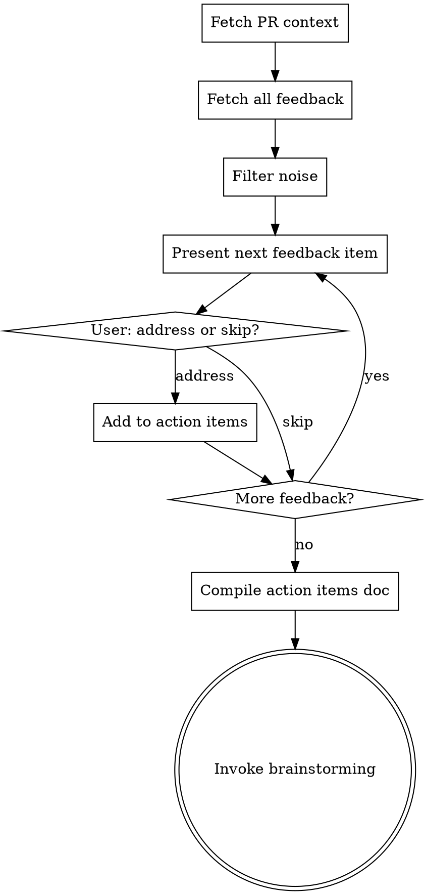

# Address PR Feedback

## Overview

Fetch all feedback on a PR using `gh` CLI, triage each item with the user, then plan the work to address accepted feedback. Each resolved item gets a reply and thread resolution on GitHub after implementation.

**Announce at start:** "I'm using the address-pr-feedback skill to triage and plan PR feedback for PR #`<number>`."

## Checklist

You MUST create a task for each of these items and complete them in order:

1. **Fetch PR context** — title, body, diff summary, review status
2. **Fetch all feedback** — reviews, inline code comments, discussion comments
3. **Triage feedback with user** — present each item, get accept/skip decision
4. **Compile action items** — summarize accepted feedback with resolution metadata
5. **Transition to brainstorming** — invoke brainstorming skill with compiled feedback

## Process Flow



## Step 1: Fetch PR Context

```bash
# Basic info
gh pr view <PR_NUM> --json title,body,state,reviewDecision,headRefName,baseRefName

# Changed files (overview)
gh pr diff <PR_NUM> --name-only

# Full diff (read into context for understanding changes)
gh pr diff <PR_NUM>
```

Present a brief summary to the user: PR title, branch, review status, number of files changed.

## Step 2: Fetch All Feedback

There are **three types** of feedback on a PR. Fetch all three:

```bash
# A. Review threads with inline comments (most important - has thread IDs for resolution)
gh api graphql --paginate -f query='
query($pr: Int!, $cursor: String) {
  repository(owner: "{owner}", name: "{repo}") {
    pullRequest(number: $pr) {
      reviewThreads(first: 100, after: $cursor) {
        pageInfo { hasNextPage endCursor }
        nodes {
          id
          isResolved
          isOutdated
          path
          line
          startLine
          diffSide
          comments(first: 50) {
            nodes {
              id
              body
              author { login }
              createdAt
            }
          }
        }
      }
    }
  }
}' -F pr=<PR_NUM>

# B. Review summaries (top-level review body text)
gh api repos/{owner}/{repo}/pulls/<PR_NUM>/reviews --jq '.[] | select(.body != "") | {id, state, author: .user.login, body}'

# C. General discussion comments (issue-level)
gh pr view <PR_NUM> --json comments --jq '.comments[] | {author: .author.login, body}'
```

## Step 3: Filter Noise

Before presenting to user, filter out:
- Bot comments (Graphite, Linear, CI bots) — check `author.login` for `[bot]` suffix
- Already-resolved threads (`isResolved: true`)
- Outdated threads (`isOutdated: true`) — mention these exist but deprioritize

Group remaining feedback by reviewer, then by file path.

## Step 4: Triage with User

Present each piece of actionable feedback **one at a time**. For each item show:
- **Who** said it (reviewer)
- **Where** in the code (file path + line, if inline)
- **What** they said (the comment body)
- **Thread context** (if there are replies in the thread, show the full conversation)

Ask the user: **Address, Skip, or Discuss?**
- **Address** — add to action items
- **Skip** — move on (optionally note reason)
- **Discuss** — talk through the feedback before deciding

Track each accepted item with its `threadId` (the GraphQL node ID) for later resolution.

## Step 5: Compile Action Items

After triaging all feedback, present a summary:

```markdown
## PR #<NUM> Feedback Action Items

**PR:** <title>
**Branch:** <head> → <base>

### Accepted Feedback (N items)

1. **[reviewer] on `path/to/file.py:42`** — <summary of feedback>
   - Thread ID: `<graphql_node_id>`
2. ...

### Skipped (M items)
- [reviewer] on `path/to/file.py:10` — <reason skipped>

### Resolution Protocol
After each item is implemented and committed, run:
1. Reply to thread: `addPullRequestReviewThreadReply`
2. Resolve thread: `resolveReviewThread`
(See resolution commands below)
```

## Step 6: Transition to Brainstorming

**REQUIRED SUB-SKILL:** Invoke `superpowers:brainstorming` with the compiled action items as context.

The brainstorming skill will explore approaches for addressing the feedback, then flow into `superpowers:writing-plans` for the implementation plan.

**Critical:** The implementation plan MUST include the thread resolution protocol as a step after each commit. Include this in the handoff context to brainstorming.

## Thread Resolution Protocol

After implementing and committing a fix for a feedback item, run these two GraphQL mutations:

```bash
# 1. Reply to the thread with the commit SHA
COMMIT_SHA=$(git rev-parse HEAD)
gh api graphql -f query='
mutation($threadId: ID!, $body: String!) {
  addPullRequestReviewThreadReply(input: {
    pullRequestReviewThreadId: $threadId
    body: $body
  }) {
    comment { id }
  }
}' -f threadId="<THREAD_NODE_ID>" -f body="Resolved by ${COMMIT_SHA}"

# 2. Resolve the thread
gh api graphql -f query='
mutation($threadId: ID!) {
  resolveReviewThread(input: {
    threadId: $threadId
  }) {
    thread { isResolved }
  }
}' -f threadId="<THREAD_NODE_ID>"
```

**Include these commands in the implementation plan** as a step after each commit that addresses a feedback item. The `<THREAD_NODE_ID>` comes from the triage phase.

## Key Principles

- **One feedback item at a time** — don't overwhelm the user during triage
- **Show full thread context** — replies may clarify or modify the original comment
- **Filter bots aggressively** — CI, Graphite, Linear comments are noise
- **Track thread IDs** — needed for resolution after implementation
- **Resolution is part of the plan** — every addressed item gets a reply + resolve step
